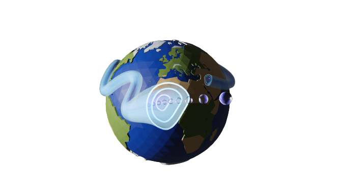




  


**The JetLag data sets and documentation will be released shortly** 
In the meantime, sign up for the [JetLag mailing list](https://web.lists.fas.harvard.edu/mailman/lists/jetlag.lists.fas.harvard.edu/) 

---

**What is JetLag?** 

JetLag is a jet tracking algorithm developed at Harvard University, in collaboration with [Dr. Jezabel Curbelo](https://web.mat.upc.edu/jezabel.curbelo/) at Universitat Politècnica de Catalunya. 
JetLag relies on Lagrangian descriptors of the general circulation, hence the name.

---

**Why JetLag?** 

Many jet tracking algorithms have been developed in the past, but significant limitations still exist. Generally speaking, existing algorithms: 
* Rely on a large number of climate-based and arbitrary parameters (e.g., wind speed and latitude thresholds) that are optimized manually;
* Exclude information about the temporal behavior of the jet, focusing on its spatial structure alone;
* Struggle identifying the subtropical and the polar front jet;

JetLag aims to address these limitations by **a)** excluding arbitrary and climatological parameters, **b)** using time-integrated variables to account for the spatial <em>and</em> the temporal behavior of the jet, and **c)** identifying subtropical and polar front jets using an objective labeling algorithm that also does not rely on any arbitrary parameter. 

---

**How does JetLag work?** 

The JetLag algorithm uses a Lagrangian descriptor of the general circulation, the 'M function,' which is equal to the length of the Lagrangian parcel trajectory that passes through a given (x,y,z) point, integrated over a chosen integration time interval. Effectively, the only parameter used in JetLag is the width of that time interval, which can be chosen objectively based on the scales of interest. Typical values range from 2 to 5 days. 
In order to avoid relying on arbitrary parameters, JetLag defines the axis of the jets as connected local M function maxima. This ensures that jets are identified that correspond to maxima in atmospheric transport, rather than maxima in wind speeds. 

---

**What will JetLag provide?** 

We're still working on it, but we expect to release several beta products by August 2022. These products will be based on the MERRA-2 reanalysis and will include: 

* A jet segment ('jegment') data set with labeled, non injective subtropical and polar front features;
* A jet coordinate data set (injective subtropical and polar front axes)

Other products will be released over time, including products for the ERAi reanalysis and for CMIP6 model runs. 
Contact us (see below) if you are interested in a product that is not available. 

---

**Can I get involved?** 

Yes! We'd love to hear your thoughts. You can reach out to us via the mailing list (once you've subscribed, email: jetlag-owner (at) lists (dot) fas (dot) harvard (dot) edu) or directly via my professional email (lrivoire (at) fas (dot) harvard (dot) edu). You can also request that JetLag be applied to a model output or reanalysis or your choosing –we want JetLag to be useful to your specific purposes! Subject to computing constraints and demand, of course.
