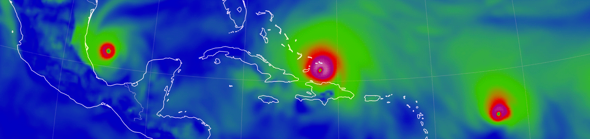
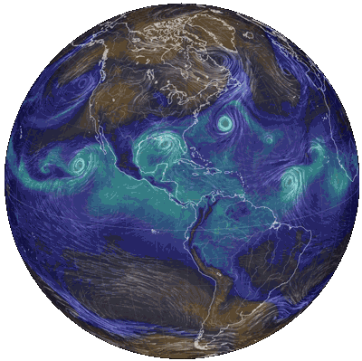




  


## Hello! My name is Louis and I am an atmospheric scientist.

<html>
<head>
<meta name="viewport" content="width=device-width, initial-scale=1">

</head>
<body>
 

  
<!-- 
hover me
 -->
  

    
  

</body>
</html>

My research focuses on tropical convection: how it works, how it organizes into phenomena like hurricanes, how it affects the Earth's climate, and how it might change in the future. I work as a postdoctoral fellow with [Dr. Marianna Linz](https://eps.harvard.edu/people/faculty-groups/linz-group) at Harvard University's Department of Earth and Planetary Sciences. More on my [research](https://lrivoire.github.io/research/).

The Earth is a wonder of beauty and complexity and I like to extend the concept of stargazing to that of [Earth gazing](https://lrivoire.github.io/earth_gazing/). I also like talking about science with nonscientists, and my [Illustrated science](https://lrivoire.github.io/illustrated_science/) project (coming soon) aims to make my research more accessible to all.

<html>
  
</html>

