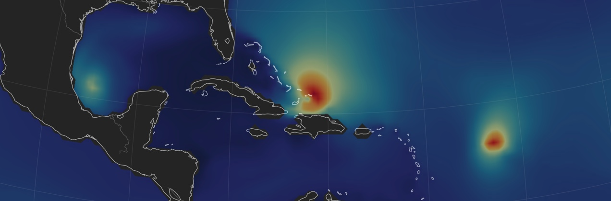
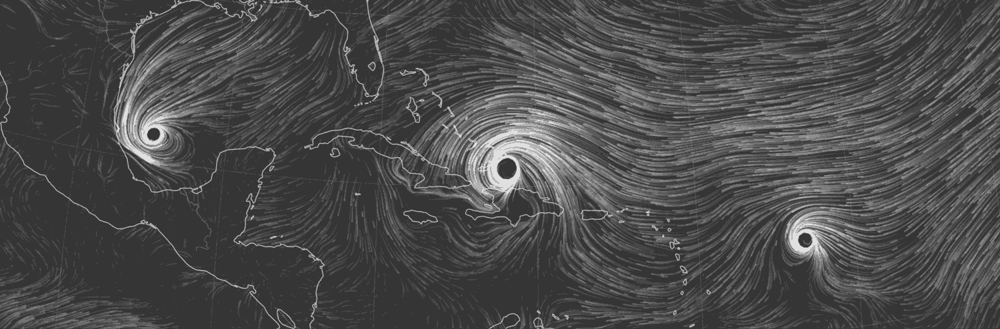




  


<html>
<head>
<meta name="viewport" content="width=device-width, initial-scale=1">

</head>
<body>
  
<h1>Hi! My name is Louis, I am an atmospheric scientist.</h1>
  

  
<!-- 
hover me
 -->
  

    
  

  

    Irma
  

  

    Katia
  

  

    Jose
  

  

    <a href="https://earth.nullschool.net/#2017/09/08/0200Z/ocean/isobaric/1000hPa/overlay=significant_wave_height/orthographic=-77.92,20.64,1100">earth.nullschool.net</a>
  

I am primarily interested in the role of the upper troposphere and lower stratosphere in the climate. I also work to understand how sampling biases and observational uncertainties affect our understanding of the climate.    <!--For instance, as the Earth continues to warm, the behavior of the jet streams changes, affecting the transport of stratospheric ozone into the boundary layer, the location of tropical cyclone landfalls, and the intensity of the stratospheric circulation.-->
My work is driven by applications in atmospheric composition, air quality, and hurricane risk.
I work as a Postdoctoral Associate with
<a href="https://www.teampaccc.mit.edu/">Dr. Arlene Fiore</a> at MIT's department of Earth, Atmospheric and Planetary Sciences.  -->

</body>
</html>
<!--In all my research projects I strive to develop objective methods that can be applied for the analysis of the atmosphere regardless of the state of the climate. 

<!--The Earth is a wonder of beauty and complexity, and I like spending time <a href="https://lrivoire.github.io/earthgazing/">Earthgazing</a>. I also like talking about science with nonscientists, and my <a href="https://lrivoire.github.io/illustrated_science/">Illustrated science</a> project (coming soon) aims to make my research more accessible to all.-->
<!--My research focuses on tropical convection: how it works, how it organizes into phenomena like hurricanes, how it affects the Earth's climate, and how it might change in the future. I work as a postdoctoral fellow with [Dr. Marianna Linz](https://eps.harvard.edu/people/faculty-groups/linz-group) at Harvard University's Department of Earth and Planetary Sciences. More on my [research](https://lrivoire.github.io/research/). The Earth is a wonder of beauty and complexity and I like to extend the concept of stargazing to that of [Earth gazing](https://lrivoire.github.io/earthgazing/). I also like talking about science with nonscientists, and my [Illustrated science](https://lrivoire.github.io/illustrated_science/) project (coming soon) aims to make my research more accessible to all.

