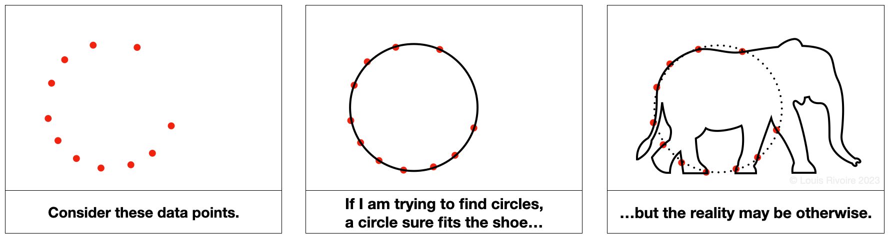
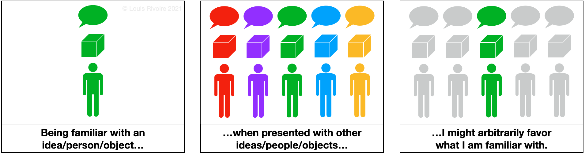
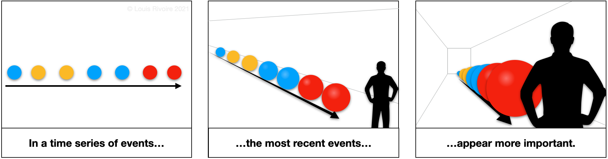
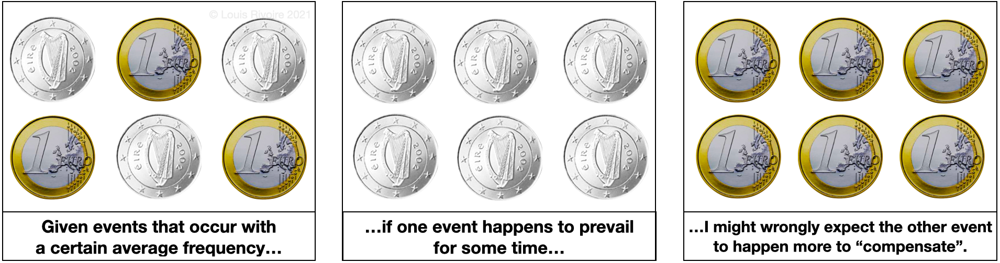
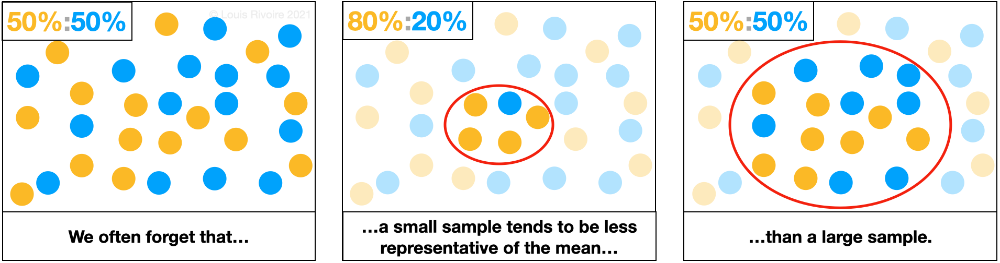
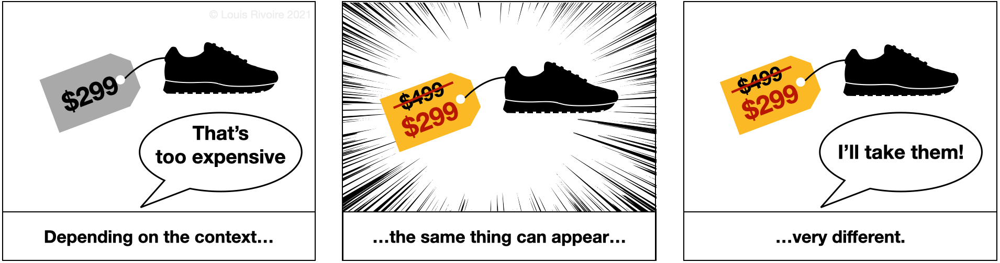
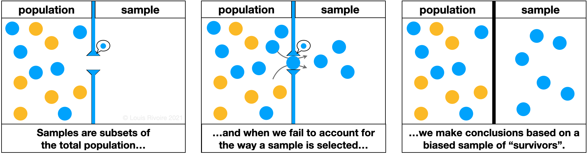




  


Disinformation, or deliberate misinformation, has a long history dating back over 2000 years. In its early form, disinformation was used to aid military tactics or to sway the public opinion in favor of a cause or against it. Since the 1920s, disinformation has also been used to manipulate enemy nations' intelligence agencies by strategically exposing them to credible but misleading information. Since 2017, the world has witnessed a sharp uptick in disinformation campaigns on an increasingly wide range of topics beyond politics.

Disinformation is now rampant, and whether it is about climate change, elections, vaccines or other conspiracy theories, whether it is spread by state actors, news sources, social media, celebrities or word of mouth, disinformation is affecting our ability to agree even on cold, hard facts. Personally, I find that troubling. Disinformation is designed to promote uncertainty, apathy, distrust, and paranoia, and it affects all of us. Disinformation is also designed to be difficult to spot, taking advantage of the current era of fast, free, and virtually illimited information. Luckily, we can get better at spotting disinformation if we know what to look for:

-   **Exaggeration**, alarmism based on anecdotes, cherry picking, one-sided arguments, parallels with extreme ideologies, miracle solutions;
-   **Speculation** ("isn't it weird that...?"), absence of verifiable sources, hearsay, insubstantial statements, reasoning based on unprovable 'facts', slippery slope arguments (a small event triggers a cascade of inevitable negative outcomes);
-   **Overuse of recognizable key words**, even off topic, associations with controversial ideas that have little in common;
-   **Call to emotions** more often negative than positive, fixation on alleged 'scandals' or unusual events;
-   **Call to distrust** governments and institutions, science and technology, undefined entities ("they") that are said to be lying to/acting against the entire population, call to consider 'mainstream ideas' as inherently wrong.

Disinformation also exploits cognitive biases to spread more efficiently. Cognitive biases arise from the fact that we do not simply **have** knowledge of the world around us. Rather, our understanding of the world is based on the **interpretation** of what we can observe --our cognition. However, our cognition depends on our emotional state and ability to think critically, and on the quality and completeness of our observations. Our cognition can be biased in many ways, a few of which are illustrated below:

**CONFIRMATION BIAS** (the M.O.A.B.)

Perhaps linked to a human tendency to seek confirmation over refutation, confirmation bias is ubiquitous. At its most basic, confirmation bias is the tendency to interpret information in a way that favors one's prior beliefs or knowledge:

A benign example is cloud watching and trying to spot a shape that someone else described for us (let’s say a whale); we might very well find said shape, but without the other person’s description it is likely that we would have interpreted the cloud as a different shape.

A less benign (albeit hilarious) example is the mass delusion known as the “Seattle windshield pitting epidemic”, which started when reports of damaged windshields triggered a self-feeding cycle between news sources reporting on windshield damage and people checking their windshields, reporting more damage (which was in fact already present before the whole thing started).

Less benign yet are the known effects of confirmation biases in jury trials, healthcare, job recruitment, and in scientific research at large. Confirmation biases are thought to lead to the persistence of discredited ideas and to the polarization of opinions. The bias is stronger for emotionally charged issues and for deeply entrenched beliefs such as those at the heart of identity-driven controversies.

When interpreting information, our judgment is often affected by many other cognitive biases. Here are a few more examples of cognitive biases (illustrations original, all rights reserved):

**MERE-EXPOSURE EFFECT** (preference for early information, the basis for advertisement):

**RECENCY BIAS**:

**GAMBLER'S FALLACY**:

**INSENSITIVITY TO SAMPLE SIZE**:

**ANCHORING BIAS**:

**SURVIVORSHIP BIAS**:

More on cognitive biases:

<b>Image Credits - Wikipedia CC BY-SA 4.0</b>
