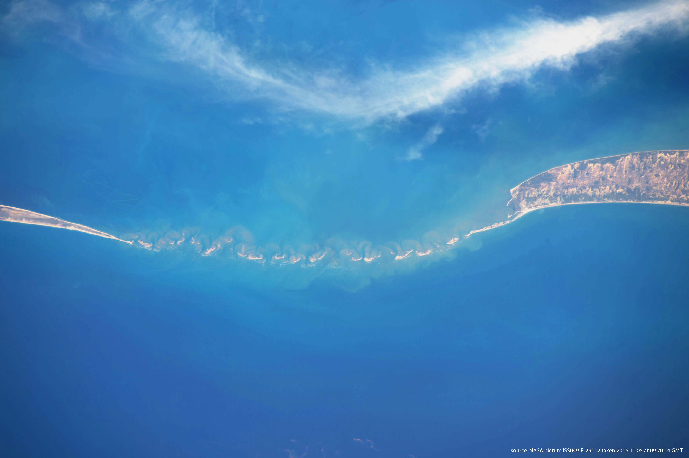
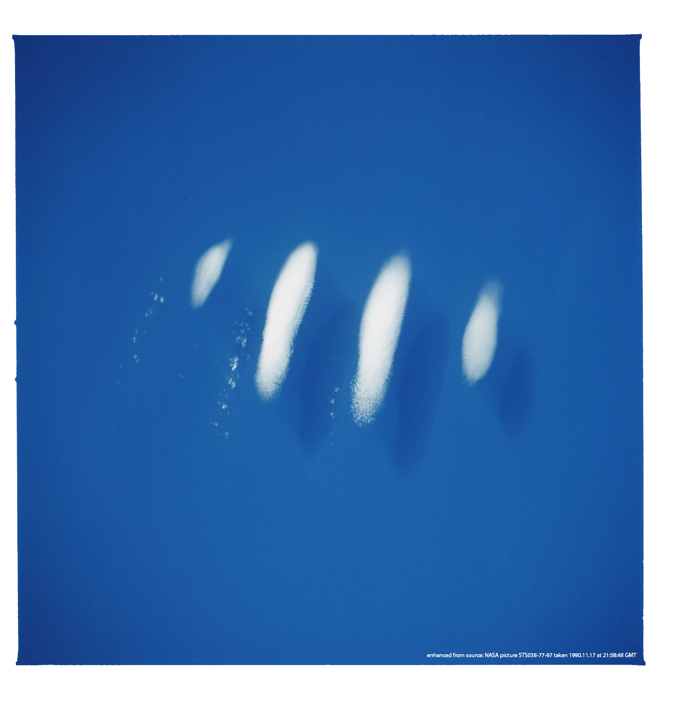
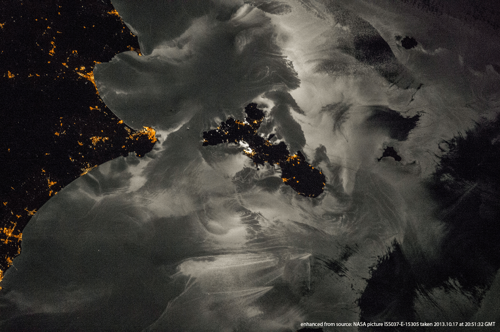
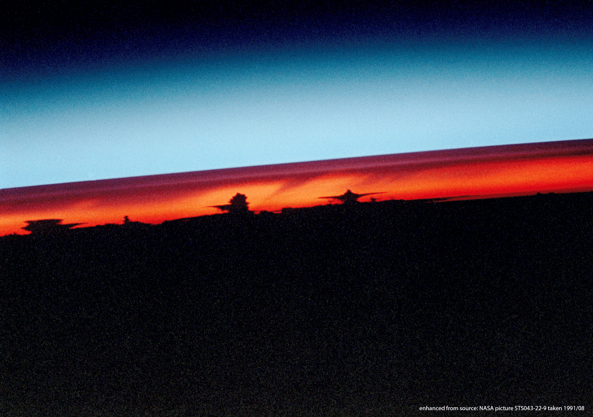




  


Our planet seen from space, for your perusing and enjoyment.

<html>
<head>
 
</head>
<body>

  

    
    
"Glint" refers to the light patch north east of Madagascar

    
Sun glint over the Indian ocean

  

  

    
    
Sunrise over hurricane Irma as it heads for the Caribbean

  

  

    
    
Vortex streets are the manifestation of vortex shedding behind an obstacle, here Guadalupe Island

    
Vortex street south of Isla Guadalupe

  

  

    
    
Vortex streets are the manifestation of vortex shedding behind an obstacle, here Guadalupe Island

    
Vortex street south of Isla Guadalupe

  

  

    
    
Multiple convective systems display atmospheric gravity waves (ripples) in their anvils

    
Waves in clouds near Hawai'i

  

  

    
    
These geometrically pleasing clouds appear very frequently in this region

    
Swirly clouds (south Pacific)

  

  

    
    
As thunderstorms develop, they produce cold air that sinks and spreads out, forming a ring of clear air (outlined in blue)

    
Cold pools (northern Australia)

  

  

    
    
The atmospheric flow is perturbed by the Appalachian moutains, creating a pattern of standing waves, here visible in the cloud field

    
Stationary waves in the cloud canopy (USA)

  

  

    
    
Wildfires sometimes release enough energy to create their own convective clouds and anvils, sometimes evenn punching into the stratosphere

    
Pyrocumulus (Queensland, Australia)

  

  

    
    
There is no physical link between the clouds and the landscape. It is simply pretty.

    
Clouds mimic Rama's Bridge (India/Sri Lanka)

  

  

    
    
An atmospheric wave, made visible to the naked eye thanks to the presence of water in the atmosphere

    
Isolated gravity wave (eastern Pacific)

  

  

    
    
On a clear night, the Moon shines light onto currents and boat wakes on the sea surface

    
Moonlight reflection (Isola d'Elba, Italy)

  

  

    
    
Astonishing side view of the atmosphere, revealing thunderstorms and their anvils (black), ash layers (dark red), and the stratosphere (blue)

    
Ash layers in the stratosphere above thunderstorms (Pinatubo eruption)

  

</body>
</html>
