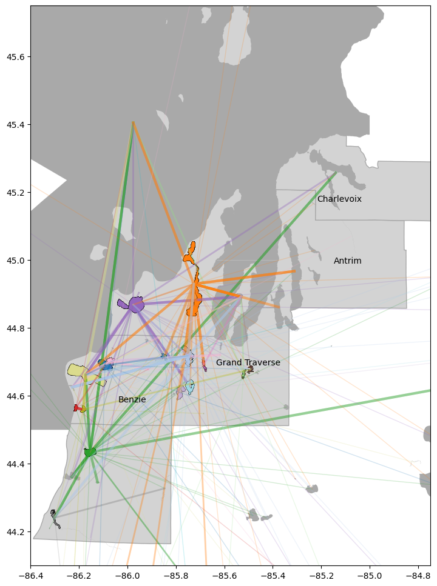
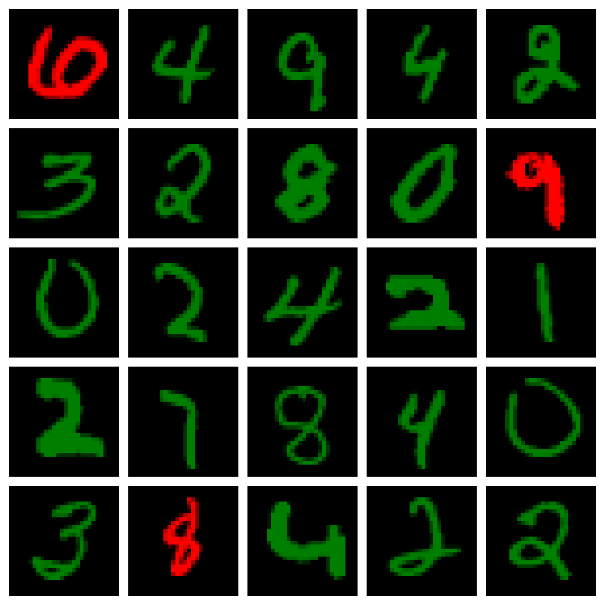




  


This is a collection of personal and volunteer projects that I’ve completed outside of formal research settings. Unlike the work featured in the Research section, these projects were not supervised or funded, nor were they conducted for academic credit. Instead, they reflect my own curiosity and drive to apply and expand my skills in data science through self-directed challenges and hands-on learning. If any of these projects interest you, I recommend looking at the github repos for more detail. 

## Monte Carlo Hurricane Track Model with Markov Chains
<figure style="text-align: center;">
  <video controls autoplay muted loop style="width:100%; max-width: 800px;">
    <source src="../files/output.mp4" type="video/mp4">
    Your browser does not support the video tag.
  </video>
  <figcaption style="margin-top: 8px; font-style: italic; color: #555;">
    Forecasting all hurricanes from 2005-2010 with the statistical model I developed. 
  </figcaption>
</figure>
This project applied 10,000 years of synthetic hurricane track data developed by the Royal Dutch Meteorological Institute to a statistical model aimed at forecasting hurricane tracks between 2005-2010. I developed a Monte Carlo hurricane track model with Markov Chains, applying the synthetic track data to construct the transition matrix. Synthetic track data makes such methods possible, considering the longest period of record for real recorded hurricane tracks would yield far too little data for a reliable transition matrix. Monte Carlo methods were applied, generating ensemble forecasts of Markov chains, approximating a distribution of hurricane tracks, allowing statistics like mean track and model spread to be calculated. This model was then applied to "forecast" all hurricane systems in the north atlantic between 2005-2010. From one single lat-lon initialization, the model is able to forecast the track of near-equator systems with surprising accuracy. Future work may involve analysis steps in forecasting, constraining the model with physical observations (500hPa geopotential), or expanding to other storm basins. 

## Benzie Conservation District Volunteer Data Science Project

Invasive species pose a serious threat to freshwater ecosystems, yet the state of Michigan currently lacks the infrastructure to effectively assess and manage their spread. As part of the Benzie Conservation District’s long-term initiative to develop an aquatic invasive species (AIS) risk assessment for recreational boating and angling pathways in Benzie, Manistee, Grand Traverse, and Leelanau Counties, this project focused on cleaning and analyzing three years of in-situ boater movement data. The raw dataset, compiled from handwritten records collected at regional boat launches, was standardized using fuzzy matching with cosine similarity to align trip entries with the State of Michigan’s official GIS lake registry, resulting in an 89% successful match rate. A network analysis was then performed to identify high-risk transmission pathways between lakes, with interactive Folium maps used to visualize these relationships and inform spatial risk. The resulting insights contribute to ongoing efforts to model AIS spread and have been incorporated into grant proposals for congressional funding to support boat-washing stations and further research.
<figure style="text-align: center;">
  

    <iframe src="../files/connections.html" width="100%" height="600" style="border:none;">
    </iframe>
  

  <figcaption style="margin-top: 10px; font-size: 0.9rem; color: #555;">
    Map illustrating frequent recreational boater and angler pathways (>3 occurances) between regional lakes in Northern Michigan. 
  </figcaption>
</figure> 

## MNIST Image Classifier Neural Network - No External Libraries/Packages

MNIST (Modified National Institute of Standards and Technology dataset) is a widely-used collection of 60,000 grayscale, 28x28-pixel images of handwritten digits (0-9), serving as a standard benchmark for training and testing image processing and machine learning algorithms. This project developed a simple 2-layer neural network, with input layer of 784 (corresponding to the 28x28 pixels), the second layer $a^{[1]}$ consisting of 20 units with $tanh$ activation. And the final output layer $a^{[2]}$ with 10 units with softmax activation to correspond to the number 0-9 that we are predicting. All the functions applied throughout this entire project were written myself using numpy, no external libraries were used. Detailed steps explaining forward propagation, backward propagation, and parameter adjustment are found on the github repo for this project. The model was able to predict the test dataset with 86.4% accuracy. 

