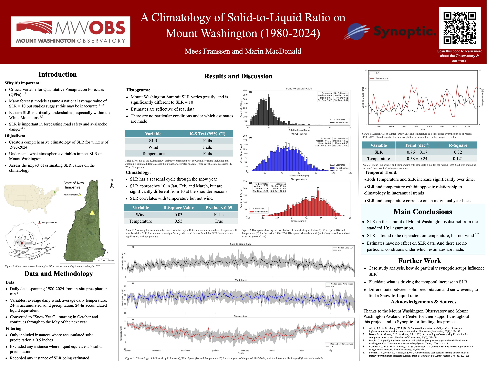
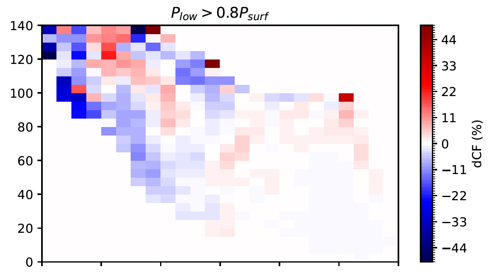




  


## Climatology of Alpine Snow

Solid-to-Liquid Ratio is measure of snow density, relating depth of snow to the depth of meltwater. An SLR of 10:1 corresponds to 10 inches of snow melting down to 1 inch of water. It is a variable useful in Quantitative Precipitation Forecasts as well as avalanche forecasting, but continues to be misrepresented in the Eastern US. Studies have found a ~10:1 average representative of conditions across the contiguous US. However, Mount Washington is a particularly unique alpine extreme environment, and has snow conditions distinct from the rest of the nation. This project investigated SLR for snow on the summit of Mount Washington to supplement an ongoing research project at the [Mount Washington Observatory](https://mountwashington.org/research/current-research-projects/solid-to-liquid-ratio-analysis/) (for contribution, see 2025 presentation); aiming to understand: how SLR varies at the summit, what variables influence SLR, and whether our methodology for collecting snow data is robust. 

The project produced a climatological analysis of SLR, wind, and temperatures for the summit of Mount Washington from 1980-2024. From this investigation we validated that our snow data collection method is robust against the weather extremes on Mount Washington. Furthermore, we found SLR is significantly different from the 10:1 average for the contiguous US, and that SLR varies dramatically through the snow year. We also found SLR to be dependent on temperature but not on wind. Results from this project have been presented at the 81st Eastern Snow Conference in Syracuse NY 2025. 

---

## Global Climate Modelling

Collaborating with ComputeCanada, I independently ported [CESM2.1.5](https://www.cesm.ucar.edu/models/cesm2) onto the Quebec-based Narval Cluster; and also acted as liaison for ComputeCanada, aiding other researchers attempting to port the model for their research projects. I then investigated CESM2.1.5 climate sensitivity to ice-nucleation parameterization schemes. 

Observations show that the Arctic is warming up to 4 times faster than the global average - a phenomenon known as Arctic Amplification (AA). This has far-reaching implications for not only Arctic biodiversity and communities but the global climate as well. Current global climate models (GCMs) tend to drastically underestimate the magnitude of AA, this is in part due to a poor representation of clouds and their radiative effects. Given GCMs have grid-cells on the order of tens of kilometres, they parameterize microphysical cloud processes with significant simplifications. A prime example would be the Meyers ice-nucleation scheme, which is derived empirically from mid-latitude observational data, extrapolating ice-nucleation exclusively as a function of temperature. GCMs tend to inadequately represent the mixed-phase clouds (containing both liquid water and ice) that commonly exist in the Arctic; often resulting in egregious errors in the partitioning of phases, size of cloud particles, and the lifetime of clouds. Ultimately, this results in errors in model projections of cloud radiative feedback processes. It is hypothesised that these misrepresentations play a part in explaining the discrepancy between observed and modelled AA. The McCluskey scheme is a promising novel parameterization, which employs aerosol active-site density in conjunction with temperature to parameterize ice-nucleation, and is thus more mechanistically percipient. This project implemented the modern McCluskey scheme into the latest version of the Community Atmosphere Model (CAM6) to improve the ice-microphysics of CAM6 and the representation of mixed-phase clouds, and illustrate a consequential improved agreement between modelled and observed AA. This project is 

---

## Climatological Analaysis

This research assistantship was supplementary to the [TEAMx field campaign](https://doi.org/10.1175/bams-d-21-0232.1) and was generously funded by the Rubin Gruber Science Undergraduate Research Award. Aimed at improving understanding the orographic (mountainous) contributions to weather and climate in central and southern Europe, my contribution concentrated on the Monte Baldo region of Italy. I produced a full climatological analysis of the Monte Baldo region, applying a swath of observational and reanalysis data products including 40 years of ERA5 reanalysis data. Key achievements of the analysis was a establishment of wind patterns that helped plan TEAMx anemometer locations as field sites. In addition to this analysis, I also conducted a preliminary investigation into the coupling of air quality in Monte Baldo and diurnal wind patterns. Leveraging fourier methods to produce coherence and phase spectra, I was able to illustrate plausible aerosol transport from the neighboring polluted urban center Vernona up to the (relatively) pristine Monte Baldo. 

---

## Atmospheric Chemisty Modelling and Machine Learning

In this project, I developed and evaluated several supervised machine learning models (XGBoost, Random Forest, and K-Nearest Neighbors) to predict the pure-component surface tension of common organic aerosol compounds. Organic aerosols can have hugely complex chemical structures, and assesing their chemical and microphysical contribution to our atmosphere can be hard to elucidate without more concretely understanding their structure. These models were trained on a curated dataset of pure component surface tension measurements, with molecular structures represented using the Simplified Molecular Input Line Entry System (SMILES). By parsing SMILES strings into molecular descriptors, the models learned to estimate surface tension based on the presence and arrangement of key functional groups such as hydroxyl, carbonyl, and carboxyl groups. This work addresses a fundamental challenge in atmospheric chemistry: accurately quantifying how organic aerosols interact with water vapor, which in turn affects cloud formation and climate forcing. Improved surface tension predictions allow for better estimations of the critical relative humidity at which aerosol particles activate into cloud droplets—a key step in understanding cloud condensation nuclei behavior.

The resulting model demonstrated strong performance in both predictive accuracy and interpretability, offering a more efficient and scalable alternative to traditional calculations. This project culminated in a peer-reviewed publication in Environmental Science & Technology, a journal of the American Chemical Society [PDF](../files/schmedding-franssen-zuend-ml.pdf). 

---
