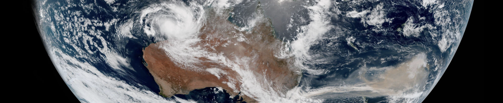
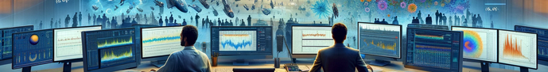
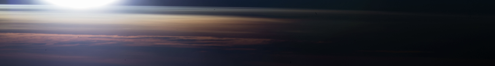
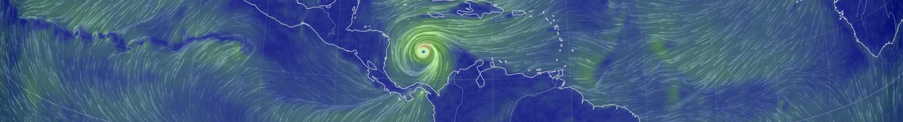
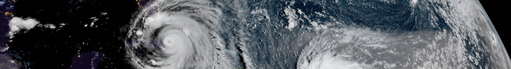




  


### Atmospheric transport and jet streams

Gases and particulates are transported on large scales by the atmosphere, affecting atmospheric chemistry, air quality, and climate. I am particularly interested in:

* Long-term changes in the behavior of the jet streams. I am developing an improved jet tracking algorithm (called [JetLag](https://lrivoire.github.io/JetLag)) in collaboration with [Dr. Jezabel Curbelo](https://web.mat.upc.edu/jezabel.curbelo/) to take a new look at this issue.
* Intercontinental transport of urban and biomass burning emissions. I am working with [Dr. Arlene Fiore](https://www.teampaccc.mit.edu/) and [Dr. Sebastian Eastham](https://www.imperial.ac.uk/people/s.eastham) to understand how the atmosphere transports and disperses pollutants, using satellite data and advanced techniques in nonlinear dynamics.<!-- My research in this area focuses on the transport of ozone between two atmospheric reservoirs with drastically different properties: the troposphere (humid and poor in ozone) and the stratosphere (very dry and rich in ozone). Sometimes, air parcels that originate in the stratosphere travel downward through the tropopause and into the troposphere, sometimes all the way down to the surface, bringing large amounts of ozone to areas that normally exhibit low concentrations of it. This process is called "tropopause folding" or "stratospheric intrusions" and can trigger air quality issues that affect human and ecosystem health, and agricultural yields. To date, we are unsure how the downward transport of ozone associated with stratospheric intrusions may change in the future. Changes in the transport may be dominated by a) changes in the composition of the lower stratosphere, or b) changes in the frequency of stratospheric intrusions. The main challenge in addressing this issue comes from limited satellite coverage and resolution. I am currently collaborating with Universitat Politècnica de Catalunya to develop JetLag, a new jet tracking algorithm that will be the first stepping stone toward taking a new look at this issue. JetLag uses Lagrangian descriptors of the general circulation to produce improved jet coordinate products that are useful in locating stratospheric intrusions. We're also using machine learning to make use of widely available total column ozone retrievals and establish an observational baseline for the ozone transport associated with stratospheric intrusions. Initial results were presented at the [2022 EGU General Assembly](https://meetingorganizer.copernicus.org/EGU22/EGU22-8959.html), and at the [SPARC General Assembly](https://lrivoire.github.io/talks/2022-10-24-talk). Sign up for the JetLag mailing list [here](https://lrivoire.github.io/JetLag).-->

---

### Emergence of climate signals

The planet is [warming](https://www.climate.gov/news-features/understanding-climate/climate-change-global-temperature), but certain detailed aspects of the consequences of this warming remain difficult to assess. The primary reasons for this are simple:

1) The climate system is full of random noise, and it is sometimes difficult to separate the signal from the noise;

2) Our observations of the climate system are far from perfect -- they have gaps, biases, and their quality changes over time.

Co-authors and I developed a [new method](https://agupubs.onlinelibrary.wiley.com/doi/full/10.1029/2024GL109638) to assess the degree of confidence we should place in long-term trends observed in our historical records, accounting for the effects of climate noise and observational uncertainties.

---

### Stratospheric ozone and circulation

The stratospheric ozone layer protects life on Earth from harmful ultraviolet (UV) radiation from the Sun, so it is no surprise that the [ozone hole](https://ozonewatch.gsfc.nasa.gov/facts/hole_SH.html) has garnered tremendous scientific concern. My contributions in this area primarily concern:

* Assisting the development of a new satellite mission at Caltech's Jet Propulsion Laboratory to monitor the circulation of the stratosphere and its connection with its composition;
* Determining whether uncertain, long-term changes in the stratospheric circulation are [detectable using observations](https://meetingorganizer.copernicus.org/EGU23/EGU23-17451.html);
* Re-assessing the degree of [confidence](https://egusphere.copernicus.org/preprints/2024/egusphere-2024-2627/) we should place in the recovery of the ozone hole as seen by satellites, with collaborators at Caltech's Jet Propulsion Laboratory, Harvard University, and Princeton's Geophysical Fluid Dynamics Laboratory. <!--Starting in the 1930s, emissions of synthetic compounds such as chlorofluorocarbons (CFCs) have depleted ozone concentrations in the stratosphere, which led to the appearance of the so-called *ozone hole*. The 1987 Montreal Protocol banned the production of CFCs, and their stratospheric concentrations have ever since been decreasing. Over time, this decrease is expected allow stratospheric ozone concentrations to return to their previous levels. However, whether ozone concentrations have already started to recover or not remains a somewhat open question; while the size of the ozone hole has generally decreased since ~2000, large recent variability prevents scienstists from reaching conclusions with a large degree of statistical confidence. At the center of this problem lies the difficult task of establishing a framework to disentangle possible trends in ozone from a multitude of long-term oscillations in the climate system and their complex interactions with changes in the circulation and in the chemical composition of the stratosphere. In addition to this challenge, one must account for the limitations of current observing systems when analyzing long-term trends. I am working with collaborators at Caltech's Jet Propulsion Laboratory and at Princeton's Geophysical Fluid Dynamics Laboratory to provide answers to the question of the statistical significance of the expected ozone recovery. [Initial results](https://ams.confex.com/ams/102ANNUAL/meetingapp.cgi/Paper/398300) were presented at the 21st Conference on Middle Atmosphere of the American Meteorological Society.-->

---

### Tropical cyclones in future climates

As the planet warms globally, regional changes also occur. In the context of tropical cyclones, this could mean that the regions where they form, intensify, and eventually make landfall could change over time. A [project](https://ams.confex.com/ams/34HURR/meetingapp.cgi/Paper/386675) in collaboration with Purdue and NOAA will look at future scenarios to inform adaptation and mitigation planning.

Tropical cyclones have historically been studied from the surface up, mostly because of the extensive damage they produce at the surface. However, tropical cyclones also affect the upper atmosphere around them, with climate impacts that are still  uncertain. I provided a new [detailed look](https://lrivoire.github.io/publication/2016-09-24-evolution) at cold anomalies found above tropical cyclones, and [ruled out](https://lrivoire.github.io/publication/2020-06-18-quantifying) the effect of clouds as the main driver of these cold anomalies. New studies have delved into mechanisms that explain this cooling, but the effects of the cooling on the cyclones themselves, if any, remain an open question.
<!-- on meso- to synoptic scales, change is expected in both the tropical cyclogenesis (where and when cyclones form) and in the so-called "steering flow" (where cyclones go). Climate simulations lend themselves well to analyzing changes in the steering flow--however, doing so has thus far involved combining complex vortex tracking algorithms, downscaling techniques, and compositing techniques. While these tools have been useful in making projections, their reliance on empirical, arbitrary, or even model-dependent parameters makes them subject to hidden sensitivities and limited reproducibility. In addition to these shortcomings, climate simulations are not designed to capture the processes at play in tropical cyclogenesis, making risk projections more uncertain. Thus, questions about future tropical cyclone risk remain undoubtedly open, calling for an approach focused on isolating the mechanisms that explain the projected changes. Answers to these questions will inform where and when tropical cyclone risk may reach new areas, a problem of particular importance to low-lying nations and to coastal populations. I am currently working with collaborators at Purdue and NOAA, using a combination of synthetic tropical cyclone trajectories, climate simulations, the historical record of tropical cyclone tracks, and a novel application of multivariate analysis. [Initial results](https://ams.confex.com/ams/34HURR/meetingapp.cgi/Paper/386675) were presented at the AMS 34th Conference on Hurricanes and Tropical Meteorology (May 2021). We are also using so-called geo-engineering scenarios from the [GeoMIP archive](http://climate.envsci.rutgers.edu/geomip/) as a way to quantify the uncertainties and risks associated with the unintended consequences of solar radiation management techniques. -->

 <!-- ### Tropical cyclone structure and dynamics

 <!-- impacts unfold at the surface, and in part because of the historical scarcity of upper-air observations above open waters.  With the advent of unmanned aircrafts and limb scanning spaceborne instruments, upper-air observations have become more readily available; for example, GPS radio occultation technology now allows the retrieval of the temperature structure in the upper troposphere and lower stratosphere (UTLS) globally, with ~100 m vertical resolution, ~0.1 K accuracy, and in all weather conditions. These data reveal the presence of a ubiquitous, synoptic-scale layer of [cold air near the tropopause above tropical cyclones](https://lrivoire.github.io/publication/2016-09-24-evolution) (and other convective systems), which I call tropopause layer cooling (TLC). The existence of this signal had been documented as early as the 1940s, but its detailed structure and evolution over the lifetime of tropical cyclones had remained unknown until recently. More importantly, the origins of TLC and its potential impacts on the development of the storm below still remain uncertain. Several mechanisms have been proposed to explain TLC, including diabatic cooling at the top of the cloud canopy, and adiabatic cooling due to ascent and divergence. We now know that [cloud radiative effects are unlikely to explain TLC](https://lrivoire.github.io/publication/2020-06-18-quantifying), and I am conducting ongoing research into the mechanisms that main explain ascent and divergence near the tropopause. As to the potential impacts of TLC on the storm below, they include increased potential intensity, turbulence in the outflow layer, heightened clouds, and possible effects on subsequent convection (after the storm has passed). A hierarchical approach with idealized simulations will be necessary to disentangle these effects. -->
