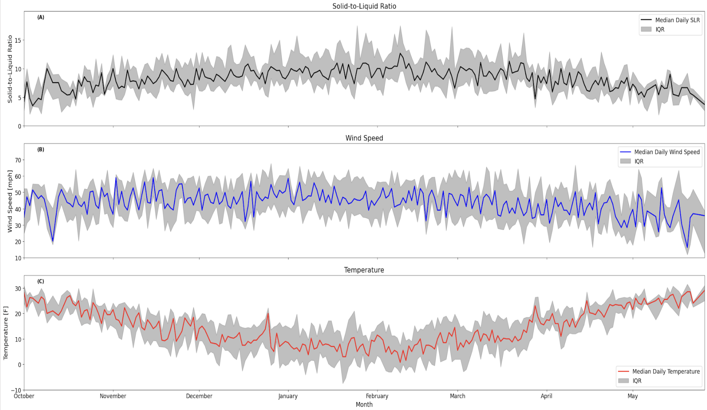




  


## Climatology of Alpine Snow

Investigated Solid-to-Liquid Ratio for snow on the summit of Mount Washington to supplement an ongoing research project at the [Mount Washington Observatory](https://mountwashington.org/research/current-research-projects/solid-to-liquid-ratio-analysis/) (for contribution, see 2025 presentation). Produced a climatological analysis of SLR for Mount Washington from 1980-2024, as well as an analysis of summit winds and temperatures. Results from this project will be presented at the 2025 Eastern Snow Conference in Syracuse NY. 

---

## Global Climate Modelling

Investigating [CESM2.1.5](https://www.cesm.ucar.edu/models/cesm2) sensitivity to ice-nucleation parameterization schemes. After independently porting the CESM2.1.5 on the ComputeCanada Narval cluster, I implemented source code changes to the atmosphere model (CAM6), to use novel ice-nucleation schemes. I conducted comparison tests between generations of ice-nucleation schemes, using model runs nudged to [MERRA2](https://gmao.gsfc.nasa.gov/reanalysis/merra-2/) reanalysis data, comparing changes in cloud fraction and surface-temperature.

---

## Climatological Analaysis

Research assistantship was supplementary to the [TEAMx field campaign](https://doi.org/10.1175/bams-d-21-0232.1). I produced a full climatological analysis of the Monte Baldo region of Italy, applying a swath of observational and reanalysis data products. Key achievements of the analysis was a establishment of wind patterns that helped plan TEAMx anemometer locations. In addition to this analysis, I also conducted a preliminary investigation into the coupling of air quality in Monte Baldo and diurnal wind patterns. Leveraging fourier methods to produce coherence and phase spectra, I was able to illustrate plausible aerosol transport from the neighboring polluted urban center Vernona up to the (relatively) pristine Monte Baldo.

---

## Atmospheric Chemisty Modelling and Machine Learning

In this project I developed machine learning approaches (XGBoost, Random Forest, and KNN) to predict the pure-component surface tension of common organic aerosol compounds. The model would interpret the Simplified Molecular Input Line Entry System (SMILES) of input organic compounds and estimate the pure component surface tension as a function of key functional groups. The projected resulted in a model that allowed for more precise calculations of aerosol behavior, specifically the level of humidity required for particles to grow into cloud droplets. Results of this project are  published in the American Chemical Society Environmental Science and Technology journal [PDF](../files/schmedding-franssen-zuend-ml.pdf). 

---
